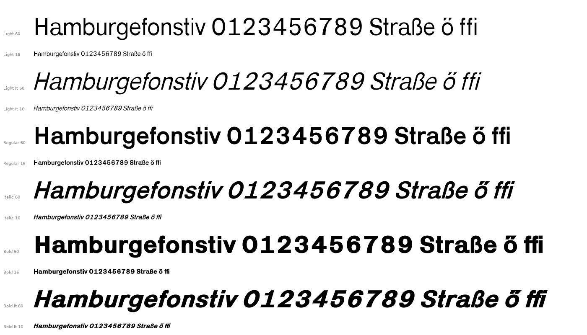

# Karrik Font Weights

unofficial light, light italic, bold and bold Italic weights for
[Karrik](https://gitlab.com/phantomfoundry/karrik_fonts), a font by Jean-Baptiste
Morizot (Phantom Foundry) and Lucas Le Bihan (Bretagne Type Foundry).



these are not drawn by Karrik's authors and are not endorsed by them. they
are generated by a script from Karrik v1.5 Regular and Italic by offsetting
every outline. they aren't pretty, but Karrik isn't supposed to be!

## details

most of this work was generated by claude. here's what it has to say

### how they are made

| Style | Source | Offset (font units) | Stem |
|---|---|---|---|
| Light, Light Italic | Regular, Italic | −20 | 119 → ~79 |
| Bold, Bold Italic | Regular, Italic | +20 horizontal, +6 vertical | 119 → ~159 |

`offset_weight.py` flattens each outline, offsets it with pyclipper, holds the
baseline, x-height, cap height and descender in place, and widens the advance
widths so the original sidebearings and kerning still apply. `build.sh` has the
exact commands.

```sh
git clone https://gitlab.com/phantomfoundry/karrik_fonts
pip install ufoLib2 fonttools pyclipper fontmake
./build.sh
```

### Known rough spots

- Curves are polygons (16 segments per curve), not Béziers. Fine at text sizes,
  faceted when very large.
- Bold: `˝` fuses into one shape, circled and squared digits clog, apertures of
  `a` and `æ` are tight, `ß` is slightly lighter than its neighbours so its gap
  stays open.
- Light: accents and dashes get very thin; `℮` is left as in Regular.
- Dots on the baseline (`. : …`) are slightly non-circular.
- The italics have 490 glyphs against 730 in the uprights, as upstream.

## license

SIL Open Font License 1.1, see [LICENCE.txt](LICENCE.txt). Karrik is by
Jean-Baptiste Morizot and Lucas Le Bihan
